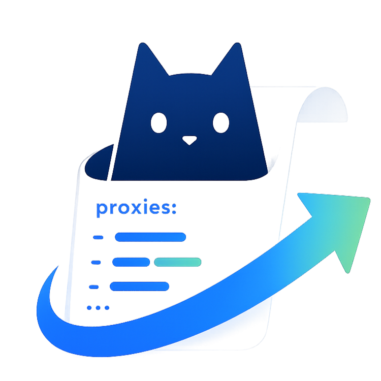
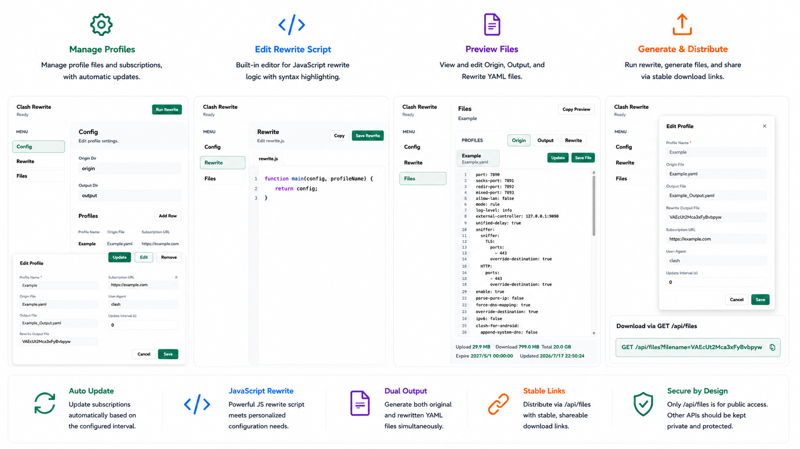

<p align="center">
  
</p>

<h1 align="center">Clash Config Rewrite</h1>

<p align="center">
  Manage, rewrite and distribute Clash subscription profiles.
</p>



## Quick Start

### Local Usage

Install dependencies:

```bash
npm install
```

Build the project:

```bash
npm run build
```

Start the application:

```bash
npm start
```

Open the web UI:

```text
http://127.0.0.1:13000
```

### Docker Compose

Build and start the container:

```bash
docker compose up -d --build
```

The compose file exposes port `13000` and mounts:

```text
./configs -> /app/configs
./origin  -> /app/origin
./output  -> /app/output
```

Open:

```text
http://127.0.0.1:13000
```

## Download Profiles

`/api/files` is designed for public exposure. It only serves files that are explicitly configured as a profile's output file or rewritten file.

If the application is exposed to the internet, only the `/api/files` endpoint should be exposed publicly. Other API endpoints provide configuration and management capabilities and should be restricted to trusted networks or protected by additional access controls.

Access control is based on possession of an unguessable filename. Therefore, each profile should use a long, randomly generated output filename, for example:

```http
GET /api/files?filename=VAEcUt2Mca3xFyBvbpyw
```

The filename effectively acts as a shared secret. Anyone who knows the URL can download the file.

## Rewrite Logic

Edit the rewrite script in the **Config** tab:

```js
function main(config, profileName) {
  return config;
}
```

`config` is the parsed YAML object from the origin profile. `profileName` is the profile's configured name.

The function may modify any part of the Clash configuration and must return a valid object.

See [rewrite.example.js](rewrite.example.js) for a complete example.

When rewrite runs, the app writes:

- `outputFile`: a YAML dump of the original parsed profile object.
- `rewriteOutputFile`: a YAML dump of the object returned by `main(config, profileName)`.